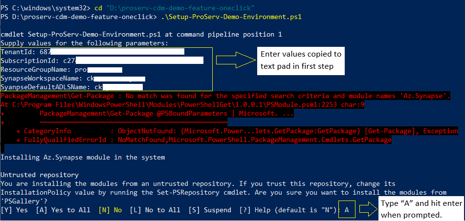

# *ProServ Demo Handbook*

## *Prerequisites* : 
 - Azure Subscription with a Resource Group to deploy
 - User must have owner access to the resource group
 

## Collect data needed to run the scripts

1. Before you get started, copy and paste below variables in a text editor for later use.:

| Variable Name		       | Description	             					    | How to Get			      |
|----------------------------- | -------------------------------------------------------------------|------------------------------------------
|TenantID | Unique identifier (Tenant ID) of the Azure Active Directory instance | Azure portal -> Azure Active Directory -> Copy TenantId |
|SubscriptionId | Subscription Id where the deployment has to be done | Azure Portal -> Subscriptions ->  Select the subscription Name -> Copy Subscription ID |
|ResourceGroupName | Resource Group name where the deployment to be made | Azure Portal -> Copy Resource Group Name |
|SynapseWorkspaceName |	Synapse workspace name | A globally unique name with at most 50 characters long, must contain only lower-case letters, digits and hyphens but can not start or end with '-', and must not contain the string '-ondemand' anywhere in the name.
|SyanpseDefaultADLSName | Default ADLS Storage account name to be linked with Synapse. | A globally unique name with only lowercase letters and numbers. Name must be between 3 and 24 characters.

## Prepare starter kit and run the client-side setup scripts

1. [Download the starter kit](https://github.com/charlskv-neu/proserv-cdm-demo/tree/feature/oneclick) , and extract its contents to the location of your choice.

2. On your computer, enter **PowerShell** in the search box on the Windows taskbar. In the search list, right-click **Windows PowerShell**, and then select **Run as administrator**.

3. Use the following command to navigate to the directory where the setup script is residing in the Powershell IDE. Replace path-to-setup-script with the folder path of the extracted Setup-ProServ-Demo-Environment.ps1 file.

	cd "path-to-setup-kit"

4. Use the following command to run the setup kit. 

	- .\Setup-ProServ-Demo-Environment.ps1
	
	- When the powershell IDE prompts to supply values for the script arguments enter the values you previously collected one by one.
	
	- If you see the warning prompt, Untrusted repository, enter A, and then press Enter.
	
	- Complete the Azure login when prompted
	
	

***
