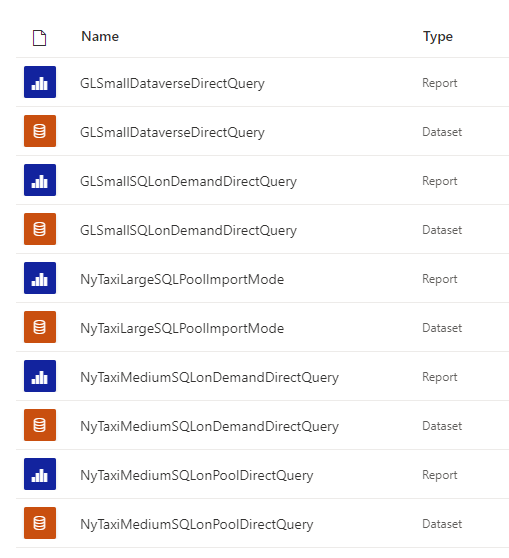
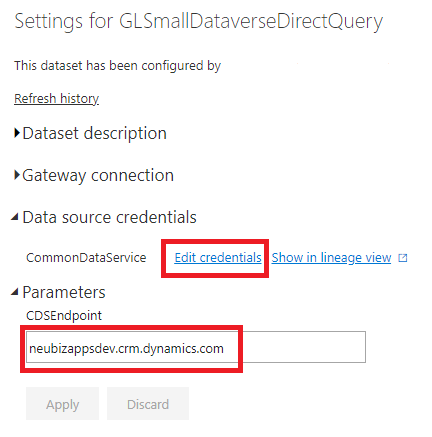
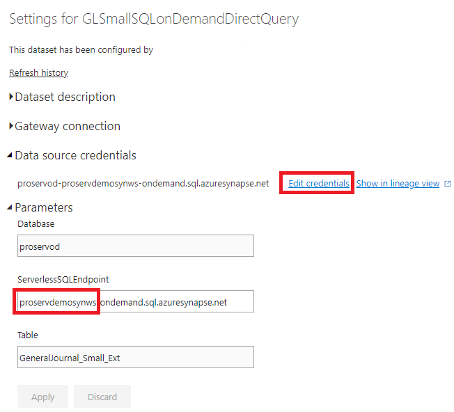
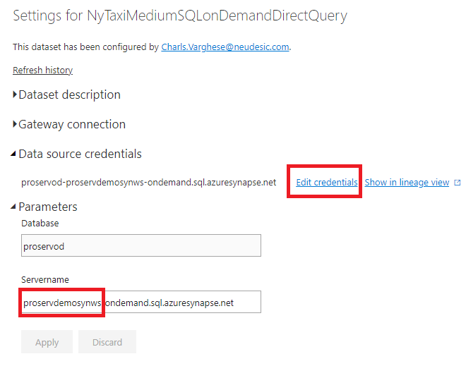
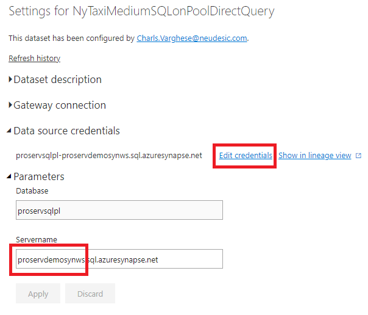
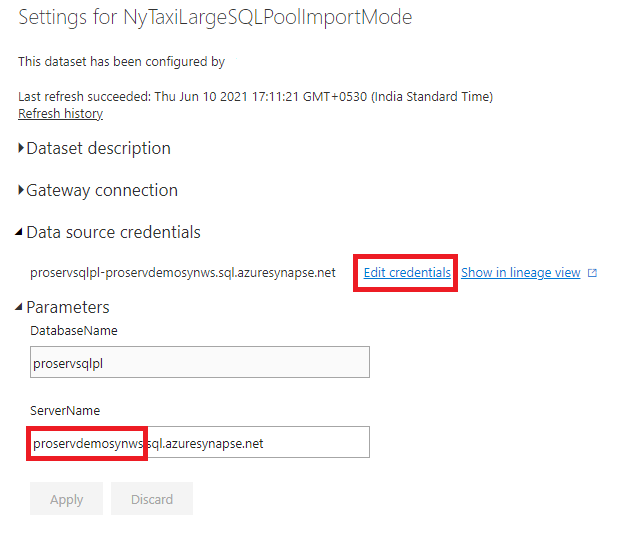

# *ProServ Business Practitioner Demo Handbook*

## *Prerequisites* : 
 - Power BI subscription with access an empty workspace
 - User must have desired access to publish to the Power BI workspace
 - Data Engineer demo must be already executed on the resource group and all the CDM output folders and Dedicated/Ondemand SQL Pool tables are created
 - User should have credentials to the Dedicated/Ondemand SQL Pools
 - User should have access to the Dataverse and the General Ledger CDM dataset must be loaded in the Dataverse table using Power App dataflow

## Post Publication of reports
 - Once the pbix files are published, you'll see below reports and datasets in the powerbi workspace
   
 - You'll have to edit the parameters in the datasource settings to repoint reports to synapse workspace/dataverse that you have provisioned
	- **GLSmallDataverseDirectQuery**: Update CDSEndpoint under parameters and edit credentials under Data source credentials to complete OAuth Sign in
	  
	- **GLSmallSQLonDemandDirectQuery**: Update synapse workspace name in ServerlessSQLEndpoint under parameters and edit credentials using SQL UserNname and Password
	  
	- **NyTaxiMediumSQLonDemandDirectQuery**: Update synapse workspace name in ServerName under parameters and edit credentials using SQL UserNname and Password
	  
	- **NyTaxiMediumSQLonPoolDirectQuery**: Update synapse workspace name in ServerName under parameters and edit credentials using SQL UserNname and Password
	  
	- **NyTaxiLargeSQLPoolImportMode**: Update synapse workspace name in ServerName under parameters and edit credentials using SQL UserNname and Password
	  
	
***
