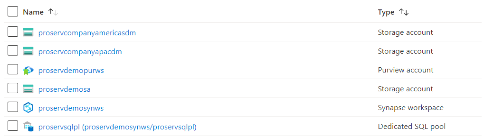

# *ProServ Data Engineer Demo Handbook*


## *Prerequisites* : 
 - Azure Subscription with a Resource Group to deploy
 - User must have owner access to the resource group
 - [Download and install](https://docs.microsoft.com/en-us/cli/azure/install-azure-cli-windows?tabs=azure-cli) the current release of the Azure CLI to run the deployment script. After the installation is complete, you will need to close and reopen any active Windows Command Prompt or PowerShell windows to use the Azure CLI.


## Collect data needed to run the scripts

Before you get started, copy and paste below variables in a text editor for later use.:


| Variable Name		       | Description	             					    | How to Get			      |
|----------------------------- | -------------------------------------------------------------------|------------------------------------------
|TenantID | Unique identifier (Tenant ID) of the Azure Active Directory instance | Azure portal -> Azure Active Directory -> Copy TenantId |
|SubscriptionId | Subscription Id where the deployment has to be done | Azure Portal -> Subscriptions ->  Select the subscription Name -> Copy Subscription ID |
|ResourceGroupName | Resource Group name where the deployment to be made | Azure Portal -> Copy Resource Group Name |
|SynapseWorkspaceName |	Synapse workspace name | A globally unique name with at most 50 characters long, must contain only lower-case letters, digits and hyphens but can not start or end with '-', and must not contain the string '-ondemand' anywhere in the name.
|SyanpseDefaultADLSName | Default ADLS Storage account name to be linked with Synapse. | A globally unique name with only lowercase letters and numbers. Name must be between 3 and 24 characters.
|AmericasADLSName | ADLS Storage account name in Americas region to be used for Third Party data. | A globally unique name with only lowercase letters and numbers. Name must be between 3 and 24 characters.
|ApacADLSName | ADLS Storage account name in APAC region to be used for Contoso data. | A globally unique name with only lowercase letters and numbers. Name must be between 3 and 24 characters.

## Prepare starter kit and run the client-side setup scripts

1. [Download the starter kit](https://github.com/charlskv-neu/proserv-cdm-demo/tree/development) , and extract its contents to the location of your choice.

2. On your computer, enter **PowerShell** in the search box on the Windows taskbar. In the search list, right-click **Windows PowerShell**, and then select **Run as administrator**.


3. Use the following command to navigate to the directory where the setup script is residing in the Powershell IDE. Replace path-to-starter-kit with the folder path of the extracted files.

	```powershell
	cd <path-to-starter-kit>\data-engineer-persona
	dir -Path <path-to-starter-kit> -Recurse | Unblock-File
	```

4. Use the following command to run the setup kit. 

	- Replace the TenantID, SubscriptionID, ResourceGroupName, SynapseWorkspaceName, SyanpseDefaultADLSName, AmericasADLSName and ApacADLSName placeholders using the data collected earlier.
	
	```powershell
	.\Setup-ProServ-Demo-Environment.ps1 -TenantId <TenantID> -SubscriptionId <SubscriptionId> -ResourceGroupName <ResourceGroupName> -SynapseWorkspaceName <SynapseWorkspaceName> -SynapseDefaultADLSName <SyanpseDefaultADLSName> -AmericasADLSName <AmericasADLSName> -ApacADLSName <ApacADLSName>
	```
	
	- Complete the Azure login when prompted
	
5. Once the deployment is complete, verify the synapse and storage account are created. Also, confirm if the Synapse artifacts are deployed too.

## Azure Services being deployed
   
This template deploys necessary resources to run an Azure Synapse Proof-of-Concept. Following resources are deployed with this template along with some RBAC role assignments:
   
- An Azure Synapse Workspace
- An Azure Synapse SQL Pool
- Three Azure Data Lake Storage Gen2 accounts
- Multiple containers inside the Storage Account to be used by Azure Synapse

## Post Deployment
- Current Azure user needs to have "Storage Blob Data Contributor" role access to recently created Azure Data Lake Storage Gen2 account to avoid 403 type permission errors.
- The user who deploys the framework is given the above role by default.
- After the deployment is complete, go to resource group and you'll see all the resources deployed in the resource group (as in the screenshot below).
  
- Click on the newly deployed Synapse workspace.
- Click on link 'Open' inside the box labelled as 'Open Synapse Studio'.
- You'll see different synapse artifacts as listed below
	- Integration Runtime
	  
	- Linked Service
	  
	- Integration DataSets
	  
	- Dataflows
	  
	- Pipelines
	  
	- ADLS Containers
	  
- Enable Dataflow debug by selecting IntegrationRuntimePerformance as the IR
	
- Execute pipelines in below order
	- GeneralLedger_CDM_Small
	- glCDMtoOnDemand_Small
	- NYTaxi_CDM_Medium
	- NYTaxi_CDM_Large
	- NYTaxiCDMtoSQLonDemand_Medium
	- NYTaxiCDMtoSQLPool_Medium
	- NYTaxiCDMtoSQLPool_Large
- You may need to change date part in the CDM Folder Path to reflect the actual fodler path in ADLS
	
	- glCDMtoOnDemand_Small
	- NYTaxiCDMtoSQLonDemand_Medium
	- NYTaxiCDMtoSQLPool_Medium
	- NYTaxiCDMtoSQLPool_Large

## Share and Recieve data using Azure Data Share for demo

- Refer this [tutorial](https://docs.microsoft.com/en-us/azure/data-share/share-your-data?tabs=azure-portal) to share and recieve data using Azure Data Share for demo

***
